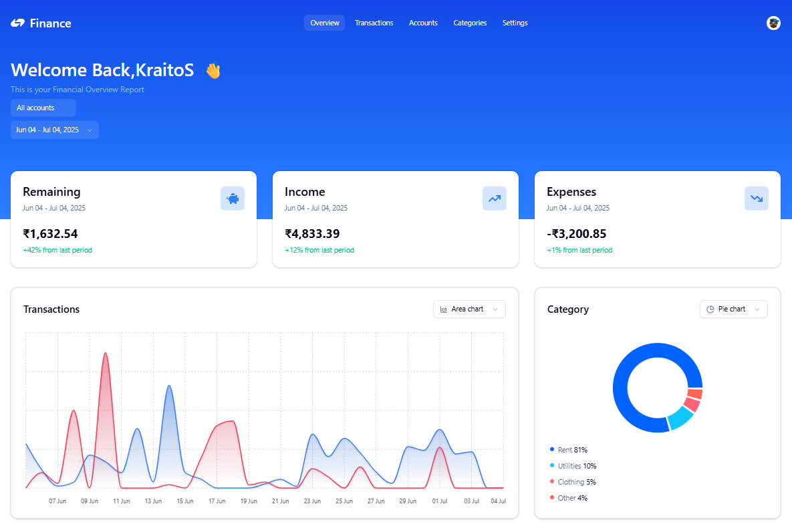

# Finance Platform – SaaS Finance Tracker

Finance Platform is a robust and modern SaaS application for tracking income, expenses, and financial health. With advanced features like CSV import, Plaid bank account integration, detailed analytics, and monetization via Lemon Squeezy, it's the all-in-one solution for personal and business finance management.

---

## 🌐 App Link

[Live Demo](https://finance-platform-eyl2.vercel.app/)

---



---

## 🚀 Technologies Used

### Frontend
- **Next.js 14** – Modern React framework for scalable frontends
- **TypeScript** – Type-safe application development
- **TailwindCSS** – Utility-first CSS framework for rapid UI
- **Shadcn UI** – Beautiful, customizable UI components
- **Tanstack React Query** – Fast, reliable client-side state management

### Backend & API
- **Hono.js** – Lightning-fast API routes and backend logic
- **Drizzle ORM** – Type-safe, modern ORM for SQL databases
- **PostgreSQL** – Scalable, powerful relational database

### Integrations
- **Clerk** – Authentication and user management
- **Middleware** - Protected routes

---

## 🎯 Features

### Dashboard & Analytics
- 📊 Interactive dashboard with visual charts (switchable types)
- 🗓 Filter data by date, account, or type
- 💹 Granular transactions table with bulk delete, search, and filters

### Transactions
- ➕ Add, edit, or delete transactions
- 🧩 Customizable select components for categories and accounts
- 💵 Income and expense toggles
- 🔄 Import transactions from CSV files

### Account & User Management
- 🔐 Secure authentication with Clerk
- 👤 User settings and customization
- 🗑 Bulk delete for transactions

### Developer Experience
- 🚀 Deployed on Vercel for instant, global access
- 💾 Modern, strongly-typed backend code with Drizzle ORM & PostgreSQL

---

## 🛠️ Getting Started

```bash
# 1. Clone the repository
git clone https://github.com/AmanM137/Finance_Platform.git
cd Finance_Platform

# 2. Install dependencies
npm install

# 3. Set up environment variables
cp .env.example .env.local
# Fill in all required ENV variables

# 4. Run database migrations
npx drizzle-kit push

# 5. Start the development server
npm run dev
```
